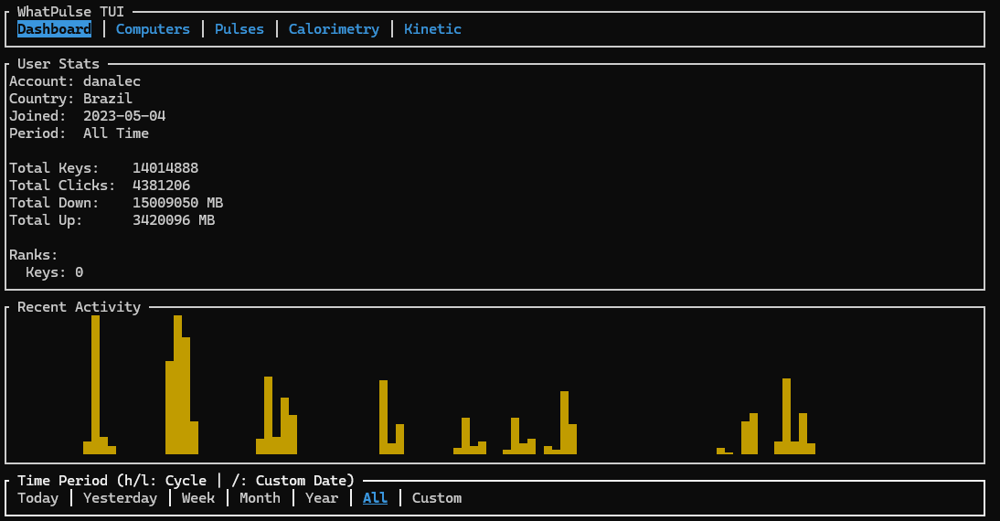

# wtfpulse

**wtfpulse** is a high-performance, asynchronous Rust CLI tool and TUI dashboard for WhatPulse. It supports both the **Web API** (online stats, pulse history) and the **Client API** (real-time local stats), offering interactive data visualization, advanced filtering, and physics-based energy estimation for your typing habits—all from the comfort of your terminal.



## Introduction

### Purpose and Scope

The goal of `wtfpulse` is to provide a type-safe, efficient, and easy-to-use command-line interface for WhatPulse. It bridges the gap between your local activity and your online profile:

*   **Web API Mode**: Connects to `api.whatpulse.org` to fetch historical data, pulses, and global ranks. Requires an API Key.
*   **Local Client Mode**: Connects to your running WhatPulse client (`localhost:3489`) to display real-time keys/sec, unpulsed stats, and total counters. No API Key required.

### Target Audience
- **Developers** integrating WhatPulse stats into their dashboards.
- **Power Users** who prefer CLI tools over web interfaces.
- **Data Enthusiasts** wanting to export or analyze their input history programmatically.

---

## Installation Guide

### System Requirements
- **OS**: Windows, macOS, or Linux
- **Rust Toolchain**: 1.70.0 or later (includes `cargo`)
- **Network**: Internet connection (Web Mode) or running WhatPulse Client (Local Mode)

### Step-by-Step Installation

1.  **Clone the Repository**
    ```bash
    git clone https://github.com/yourusername/wtfpulse.git
    cd wtfpulse
    ```

2.  **Build the Project**
    Use Cargo to build the release binary:
    ```bash
    cargo build --release
    ```

3.  **Verify Installation**
    Run the binary to see the help message:
    ```bash
    ./target/release/wtfpulse --help
    ```

### Configuration

#### Web Mode (Recommended)
To access historical data, pulses, and global ranks, you must provide a **Web API Token**.
1.  Go to your [WhatPulse Dashboard](https://whatpulse.org/dashboard).
2.  Generate a Web API Token.
3.  Set the environment variable:

**PowerShell:**
```powershell
$env:WHATPULSE_API_KEY = "your-long-bearer-token"
```

**Bash/Zsh:**
```bash
export WHATPULSE_API_KEY="your-long-bearer-token"
```

#### Local Mode
If no `WHATPULSE_API_KEY` is set, `wtfpulse` automatically falls back to **Local Mode**.
*   **Requirement**: The WhatPulse client must be running and the **Client API** must be enabled in Settings.
*   **Features**: Real-time stats, unpulsed counts, and total stats. (Pulse history and detailed period filtering are disabled).

---

## Usage Documentation

For a complete list of commands and detailed explanations, please refer to the [Commands Reference](docs/commands.md).

For developers interested in the internal structure or adding new commands, see the [Architecture Guide](docs/architecture.md).

If you want to contribute or add new commands, check out the [Contribution Guide](docs/contributing.md).

`wtfpulse` uses a subcommand structure. The general syntax is:
```bash
wtfpulse [SUBCOMMAND]
```

If no subcommand is provided, it defaults to the **TUI Dashboard**.

### Core Features
- **TUI Dashboard**: Interactive terminal interface.
    - **Web Mode**: Dynamic tab system, real-time filtering, custom date range analysis.
    - **Local Mode**: Real-time typing speed (Keys/s), unpulsed stats, and total counters.
- **User Stats**: View global keys, clicks, and rank.
- **Pulses**: List recent pulse history (Web Mode only).
- **Computers**: Enumerate all computers associated with the account.
- **Calorimetry**: Calculate energy burned by typing (physics-based estimation). Works in both modes.
- **Kinetic Monitor**: Real-time visualization of typing velocity, acceleration, and power.
- **Raw Access**: Query any API endpoint manually for debugging or new features.

### TUI Dashboard Features

The interactive dashboard (`wtfpulse tui` or just `wtfpulse`) offers a rich, terminal-based user interface for monitoring your stats.

#### Navigation & Global Controls
| Key | Action |
| :--- | :--- |
| `Tab` / `Right Arrow` | Switch to the next tab (Dashboard, Computers, Pulses, Kinetic, etc.). |
| `Left Arrow` | Switch to the previous tab. |
| `r` | **Refresh** data from the API. |
| `q` | **Quit** the application immediately. |
| `Esc` | **Quit** the application (unless a popup is open). |

#### Dashboard Tab (Web Mode)
The main **Dashboard** tab provides a summary of your activity with powerful time-based filtering.

**Time Period Selection:**
You can filter your displayed stats (Keys, Clicks, Download, Upload) by specific time periods.

| Key | Action |
| :--- | :--- |
| `h` / `[` | Cycle time period **backward** (e.g., Today -> Custom -> All). |
| `l` / `]` | Cycle time period **forward** (e.g., Today -> Yesterday -> Week). |
| `/` | **Quick Switch to Custom Range**: Automatically selects "Custom" and opens the Date Picker. |
| `Enter` | Open the Date Picker (only when "Custom" period is already active). |

#### Dashboard Tab (Local Mode)
When running without an API key, the dashboard simplifies to show real-time metrics:
*   **Total Stats**: Lifetime keys, clicks, uptime.
*   **Real-time Stats**: Current typing speed (Keys/s) and estimated power (Watts).
*   **Unpulsed Stats**: Pending keys and clicks since the last pulse.

#### Kinetic Tab
A physics-based dashboard for real-time typing analysis.
*   **Metrics**: Peak Finger Velocity, Burst Acceleration, Instantaneous Power (Watts).
*   **Controls**:
    *   **`u`**: Toggle units between **Metric (m/s)** and **Centimeters (cm/s)**.
    *   **`p`**: Cycle through keyboard switch profiles (affects force/distance calculations).
    *   **`Space`**: Trigger a manual pulse (Local Mode only).

#### Custom Date Picker (Web Mode Only)
When you press `/` or select "Custom", a calendar popup appears, allowing you to define a specific analysis range.

**How to Use:**
1.  **Start Date**: The picker opens asking for the *Start Date*. Navigate to your desired start date and press `Enter`.
2.  **End Date**: The prompt changes to *End Date*. Navigate to your desired end date and press `Enter`.
3.  **Result**: The dashboard updates to show stats *only* for pulses within that inclusive range.

**Picker Controls:**
| Key | Action |
| :--- | :--- |
| `Arrow Keys` | Move the cursor day-by-day or week-by-week. |
| `PgUp` / `PgDn` | Jump to the previous or next month. |
| `Enter` | Confirm the selection (Start Date first, then End Date). |
| `Esc` | **Cancel/Close** the popup without applying changes. |

### Practical Examples

#### Example 1: Fetching User Statistics
**Description**: Retrieve your global account statistics, including total keys and clicks.

**Code**:
```bash
# Assuming binary is in path or run via cargo
cargo run -- user
```

**Expected Output**:
```text
User: UserResponse { id: Some("12345"), username: Some("JaneDoe"), keys: Some(15000000), clicks: Some(5000000), ... }
Username: JaneDoe
```

#### Example 2: Listing Recent Pulses (Web Mode)
**Description**: View the last 5 pulses to track your recent activity.

**Code**:
```bash
cargo run -- pulses
```

**Expected Output**:
```text
Found 5 pulses:
Pulse 987654: 5200 keys on My-Laptop
Pulse 987653: 1200 keys on Work-PC
Pulse 987652: 8500 keys on My-Laptop
Pulse 987651: 300 keys on Work-PC
Pulse 987650: 15000 keys on Gaming-Rig
```

#### Example 3: Debugging with Raw JSON
**Description**: If a new endpoint isn't supported yet, or you want to see the raw JSON structure, use the `raw` command.

**Code**:
```bash
# Fetch raw data for the user endpoint
cargo run -- raw /api/v1/user
```

**Expected Output**:
```json
{
  "AccountName": "JaneDoe",
  "Country": "United States",
  "Keys": "15000000",
  "Ranks": {
    "Keys": 42
  }
}
```

---

## API Reference

This tool maps to the standard WhatPulse Web API and the Local Client API.

| Command | Target Endpoint | Description |
| :--- | :--- | :--- |
| `user` | `/api/v1/user` (Web) or `/v1/account-totals` (Local) | Fetches User object (Account Name, Keys, Clicks). |
| `pulses` | `/api/v1/pulses` (Web) | Fetches array of `PulseResponse` objects. (Web Only) |
| `computers` | `/api/v1/computers` (Web) | Fetches array of `ComputerResponse` objects. (Web Only) |

### Error Codes
- **401 Unauthorized**: Your `WHATPULSE_API_KEY` is missing or invalid (Web Mode).
- **404 Not Found**: The endpoint path is incorrect.
- **500 Internal Server Error**: The WhatPulse API is experiencing issues.
- **Connection Refused**: The Local Client is not running or Client API is disabled (Local Mode).

---

## Troubleshooting

### Common Issues

1.  **"set WHATPULSE_API_KEY environment variable..."**
    - **Cause**: The tool cannot find the API key in your environment.
    - **Solution**: Export the variable for Web Mode, or ensure the Client is running for Local Mode.

2.  **"request failed: GET ..."**
    - **Cause**: Network connectivity issue or DNS failure.
    - **Solution**: Check your internet connection and ensure `api.whatpulse.org` is reachable.

3.  **"No computers available in Local Mode"**
    - **Cause**: Local Mode does not support per-computer statistics.
    - **Solution**: Add a valid `WHATPULSE_API_KEY` to switch to Web Mode.

### Debugging
To see more details, you can run the tool with Rust backtraces enabled if it crashes:
```bash
RUST_BACKTRACE=1 cargo run -- user
```

---

## FAQ

**Q: Can I use this with the local client API?**
A: Yes! If you don't provide an API key, `wtfpulse` automatically connects to `localhost:3490` to fetch real-time stats from your running client.

**Q: Is this official?**
A: No, this is a community-driven open-source project.

**Q: How often can I pull data?**
A:
*   **Web Mode**: Respect WhatPulse's API rate limits. Generally, do not poll more than once every few minutes.
*   **Local Mode**: You can poll as often as you like (real-time).

---

## Contributing Guidelines

We welcome contributions!

1.  **Reporting Issues**: Open an issue on GitHub describing the bug or feature request.
2.  **Pull Requests**:
    - Fork the repo.
    - Create a feature branch (`git checkout -b feature/amazing-feature`).
    - Commit your changes.
    - Push to the branch.
    - Open a Pull Request.
3.  **Code Style**: Run `cargo fmt` before committing to ensure standard Rust formatting.

---

## License Information

Copyright (c) 2026.

This project is licensed under either of

* Apache License, Version 2.0
  ([LICENSE-APACHE](LICENSE) or http://www.apache.org/licenses/LICENSE-2.0)
* MIT license
  ([LICENSE-MIT](LICENSE) or http://opensource.org/licenses/MIT)

at your option.

**Usage Restrictions**:
- You may freely use, modify, and distribute this software.
- Attribution is required.
- No warranty is provided.
